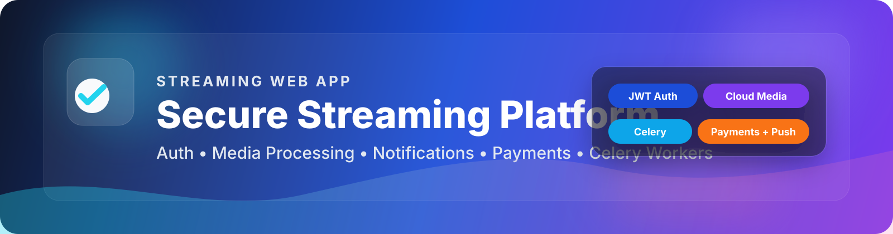
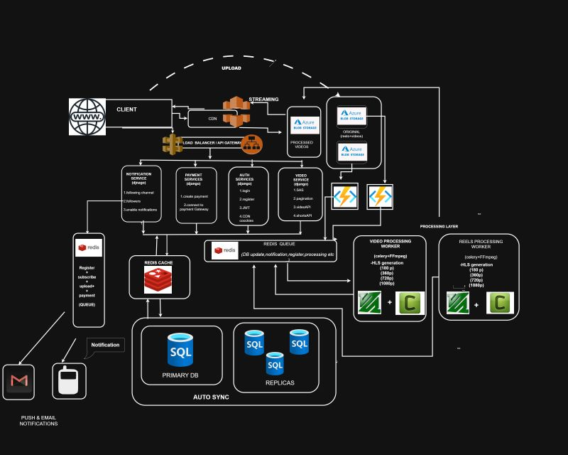
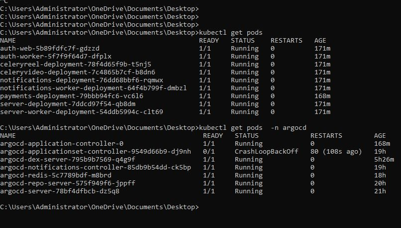
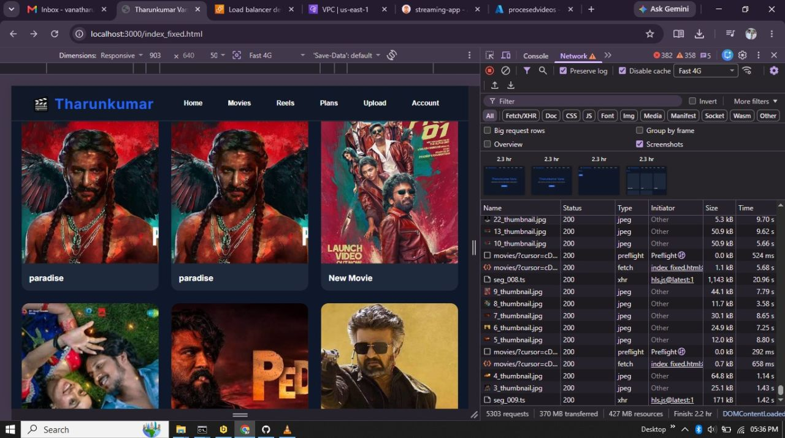
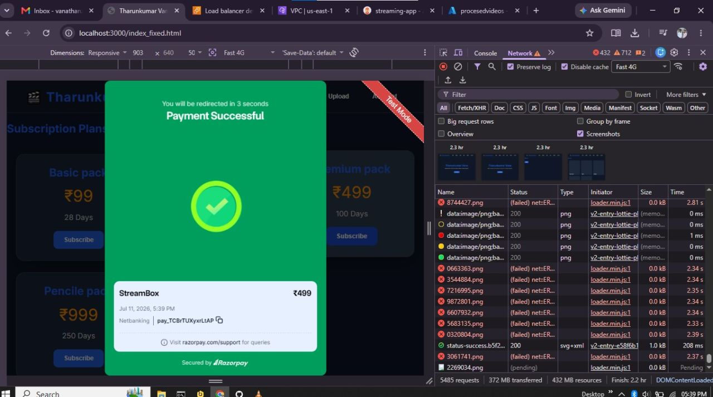
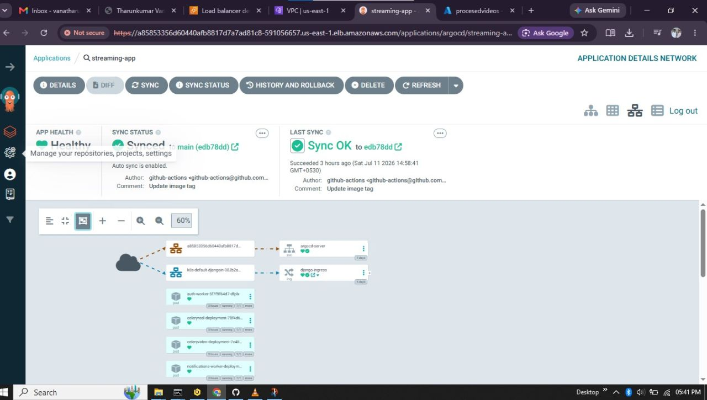
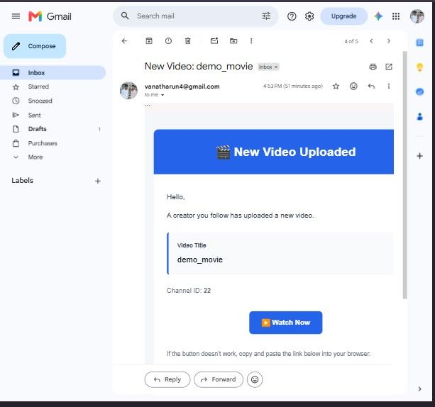
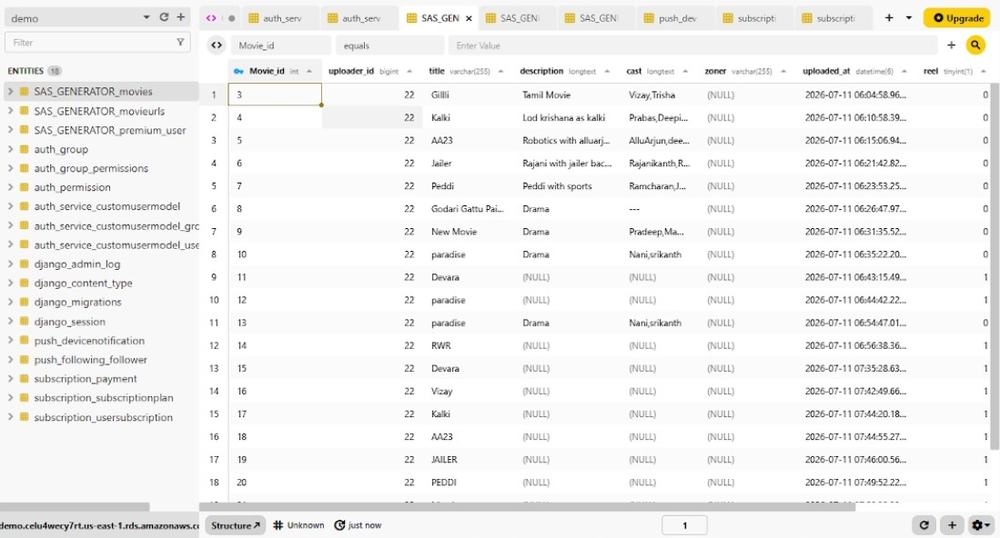

# 🎬 Streaming-web-app
## ⚡ End-to-End Streaming Platform for Auth, Media, Notifications,Payments and video processing service



<!-- Replace the image above with your actual hero banner or screenshot -->

## 🌟 Overview

**Streaming-web-app** is a modular streaming web platform built to support secure authentication, media processing, notifications, payment workflows, and asynchronous background jobs.

The project combines:
- 🛡️ **Auth services** for registration, login, JWT sessions, and password reset
- 🎥 **Video/Reel pipelines** for blob-triggered processing and worker-based tasks(1080p,720,360p)
- 🔔 **Notification services** for push and email-driven user engagement
- 💳 **Payments modules** for subscription and billing flows
- ⚙️ **Celery workers** for asynchronous processing and queue-based jobs
- ☁️ **Azure Functions** for event-driven cloud integration

---

## 🧩 Key Features

- 🔐 Secure email-based authentication with JWT access/refresh tokens
- 🍪 CloudFront signed cookie support for protected media delivery
- 📩 Email and notification workflows for user engagement
- 🧵 Background task processing with Celery + Azure Redis
- 📦 Blob event handlers for media upload automation
- 💰 Payment-related backend modules
- 🧱 Modular service layout for easier scaling and maintenance

---

## 🏗️ Architecture Diagram



## 🖼️ Screenshots / Images

| Image | Purpose |
|---|---|
|  | Applications / Argocd  kuberneties pods |
|  | Main application Home page |
|  | Razorpay gateway integration |
|  | Argocd UI  |
|  | Mail notifications  |
<!-- Tip: keep images in docs/images/ for clean documentation structure -->

---

## 🛠️ Tech Stack

- **Backend:** Django, Django REST Framework, SimpleJWT(stateless tokens)
- **Async Jobs:** Celery, Redis
- **Cloud:** Azure Functions, Azure Blob Storage,AWS CloudFront,Azure Redis(cache),EKS(elastic k8s cluster)
- **Notifications:** Firebase Admin(FCM), django-push-notifications
- **Payments:** Razorpay
- **Auth / Security:** JWT, Django auth, CORS, dotenv

---

## 📁 Repository Structure

```text
Streaming-web-app/
├── blob_event_reels/
├── blob_event_videos/
├── CeleryConsumer/
├── CeleryConsumerforreel/
├── my_project_auth/
├── myproject_server/
├── notifications/
├── payments/
```

---

## 🔐 Authentication Service

The auth service provides:
- User registration
- Login with JWT token issuance
- Password reset
- CloudFront cookie refresh for protected content

---

## 📦 Other Services

### 🎞️ Media Processing
- Blob-triggered media workflows
- Celery-based task orchestration
- Upload/download processing helpers

### 🔔 Notifications
- Push notification utilities
- Firebase integration
- Email task pipelines

### 💳 Payments
- Subscription/payment service structure
- Dedicated frontend for billing-related flows

### 🧠 Server APIs
- Django REST endpoints for application logic
- Cursor pagination demo and SAS generation utilities

---

## ✅ Prerequisites

- Python 3.12+
- `uv` recommended for dependency management
- Redis for Celery workflows
- Azure Functions Core Tools for function apps
- Django-compatible environment variables

---

## 🚀 Setup

### 1) Clone the repository

```bash
git clone https://github.com/tharunkumar453/Streaming-web-app.git
cd Streaming-web-app
```

### 2) Install dependencies

```bash
uv sync
```

---

## 🏃 Build & Run

### Django Auth Service

```bash
cd my_project_auth
python manage.py migrate
python manage.py runserver 8001
```

### Main Server

```bash
cd myproject_server
python manage.py migrate
python manage.py runserver 8000
```


Use the same approach for:
- `myproject-server-frontend`
- `notifications-frontend`
- `payments-frontend`

### Celery Workers

```bash
cd CeleryConsumer
celery -A celery_app_instance worker --loglevel=info
```

```bash
cd CeleryConsumerforreel
celery -A celery_app_instance worker --loglevel=info
```

### Azure Functions

```bash
cd blob_event_videos
func start
```

```bash
cd blob_event_reels
func start
```

---

## 🔧 Environment Variables

Create `.env` files for the services that need them.

### Auth / CDN

```env
KEY_PAIR_ID=your-key-pair-id
CDN_DOMAIN=your-cdn-domain
CLOUDFRONT_PRIVATE_KEY=your-private-key
```

### Celery / Redis

```env
REDIS_URL=redis://localhost:6379/0
```

### Azure

```env
AZURE_STORAGE_CONNECTION_STRING=your-connection-string
AzureWebJobsStorage=your-storage-connection-string
```

---

## 📡 API Highlights

Important routes in the project:

Authentication:

- `/auth/add-user/` → register user
- `/auth/login/` → authenticate user
- `/auth/reset-password/` → update password
- `/auth/api/token/refresh/` → refresh access token
- `/auth/refresh-cloudfront-cookies/` → renew signed CDN cookies

Main Service:
- `/pagi_demo/movies` → get movies 
- `/pagi_demo/movies/<int:Movie_id>/` → get details of a spacific movie
- `/pagi_demo/reels` →  get reels
- `/sas_generator/upload-movie/` → upload movie
- `/sas_generator/upload-reel/` → upload reel


notifications:
- `/notifications/push/api/devices/register` → Register for FCM (push notifications) 
- `/notifications/push/follow/<int:channel_id>` → follow the channel
- `/notifications/push/following/` → get how many followers i have?


payments:
- `/payments/plans/` → get subscription plans
- `/payments/create-order/` →  create payment order
- `/payments/verify-payment/` → payment verification
- `/payments/webhook/` → webhook for payment verifications


---


## 📸 Database


Recommended folder:

```text
docs/images/
```

---
